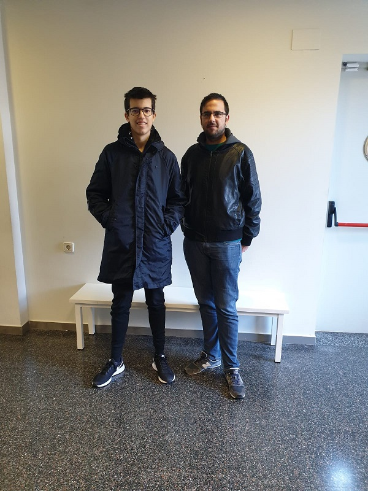

Game description and context
-
Fire & Ice is a jump 'n run platformer game.You will be able to play with a little unicorn being able to jump, run, change between forms, kill enemies and even die falling into the venom! Make sure to save the game in crucial situations. Fire goes with fire and ice goes with ice. Don't forget that!

This is a game developed for educational purposes, we are a group of two guys who go to college. This is part of the subject Videogame Development of the degree that we study called Videogame design and development in CITM, Terrassa, Spain.

This project consists of develop a platform game and program it from the beggining using SDL, TILED and XML. So the whole group is going to program the game but we had to take some responsabilities that were given to each of the group.

Development team
-
Our team consists of two members:

- Lluís Moreu as the manager and lead designer.
- Cere Venteo as the lead programer and lead tester.

This doesn't mean that we had to participate only in our assignments, but everyone had to take care that of some things in order to forget nothing for the delivery.

<!-- comentario -->

## Who made what

### Assignment 1
Cere Venteo -> All related with Player, Scenes and Collisions.

Lluís Moreu -> All related with art and design such as tiled levels, search music and fx and create character textures. Volume functions. Save and Load.
### Assignment 2
Cere Venteo -> Dash player, Framerate + dt, Pause button, collision system, Player as Entity, Scene2 Module deleted, Enemies logic.

Lluís Moreu -> Pathfinding, Entity + Entity manager, UML Entities, Enemies, Enemies textures, Brofiler.
### Assignment 3
Cere Venteo -> Fix dt and enemies, Timer and Slider, Some GUI HotFixes, HUD animation, GUI parent-child system, Fix volume functions.

Lluís Moreu -> GUI structure and elements, Create mainmenu level, Create GUI,Coin entity, UML GUI, Brofiler, Website.

Core Subsystems of the game
-
On the top of everything there is the main module called DevRookiesApp.cpp . This module manages all the other modules calling in a loop its respective Awake, PreUpdate, Update, Postupdte, Cleanup that they share through a base class Module.h . Do not forget that there is a Main.cpp that has a switch of the different states said before.

Then the game is divided in 4 main blocks:
- The Scene where everything is printed managed by a module called SceneManager.
- The Modules that manage different aspects of the game such as: audio, input, collisions, renderer, etc...
- The Entities such as: coins, enemies and player; managed by a module called EntityManager.
- The GUI where there are some classes that represent diferent elements of gui such as: images, buttons, labels and sliders. This is managed by a module called GUIManager.

Innovations
-
Assignment 1: The player can change between two forms in order to walk on the different types of platforms. Volume setUp with F7,F8,F11.

Assignment 2: The player dashes, being able to kill enemies. Collider system. EnemySpawner system from Tiled. GodMode visualize and pause debuggers.

Assignment 3: Parent-child system for the UI, UI rects charged from XML, UI with some animations, UI main menu is a map with some entities around there.Icon of exe changed from visual.

Links
-
Lluis Moreu https://github.com/youis11

Francisco Javier Venteo: https://github.com/CereVenteo

Github repository: https://github.com/DevRookies/Development

Github organization: https://github.com/DevRookies

Releases: https://github.com/DevRookies/Development/releases

Gameplay video
-
<iframe width="560" height="315" src="https://www.youtube.com/embed/1yz3LvRR7_o" frameborder="0" allow="accelerometer; autoplay; encrypted-media; gyroscope; picture-in-picture" allowfullscreen></iframe>

Instructions to execute the game
-
1.- Download the last release on https://github.com/DevRookies/Development/releases

2.- Unzip the file

3.- Execute DevRookies.exe

Controls
-
~~~~~~~~~~~~~~~

General controls:

- ESC (to show HUD during levels).

- F5 (to save game).

- F6 (to load game).

- Down Arrow (to volume down).

- Up Arrow (to volume up).

- M (to mute game).

- Left click (to control the GUI).

Player: 

- A (to go backwards).
- S (to change between forms).
- D (to go forwards).

- B (to dash).

- SPACE (to jump).

Debug keys:

- F1 (to start from level 1).

- F2 (to start from current level). 

- F3 (to start from level 2).

- F8 (to debug GUI).

- F9 (to debug colliders and pathfinding).

- F10 (to go GodMode).

- F11 (to disable framerate cap).

- WASD (to move with GodMode).

~~~~~~~~~~~~~~~

License
-
Copyright (c) [2018] [Lluís Moreu & Cere Venteo]

Permission is hereby granted, free of charge, to any person obtaining a copy
of this software and associated documentation files (the "Software"), to deal
in the Software without restriction, including without limitation the rights
to use, copy, modify, merge, publish, distribute, sublicense, and/or sell
copies of the Software, and to permit persons to whom the Software is
furnished to do so, subject to the following conditions:

The above copyright notice and this permission notice shall be included in all
copies or substantial portions of the Software.

THE SOFTWARE IS PROVIDED "AS IS", WITHOUT WARRANTY OF ANY KIND, EXPRESS OR
IMPLIED, INCLUDING BUT NOT LIMITED TO THE WARRANTIES OF MERCHANTABILITY,
FITNESS FOR A PARTICULAR PURPOSE AND NONINFRINGEMENT. IN NO EVENT SHALL THE
AUTHORS OR COPYRIGHT HOLDERS BE LIABLE FOR ANY CLAIM, DAMAGES OR OTHER
LIABILITY, WHETHER IN AN ACTION OF CONTRACT, TORT OR OTHERWISE, ARISING FROM,
OUT OF OR IN CONNECTION WITH THE SOFTWARE OR THE USE OR OTHER DEALINGS IN THE
SOFTWARE.
